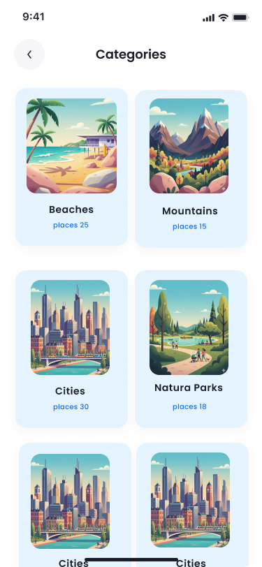
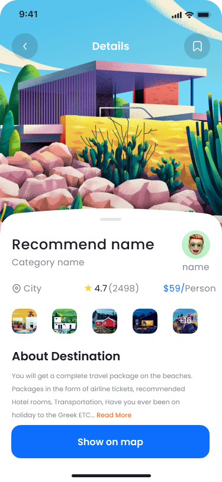
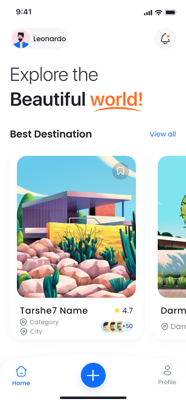
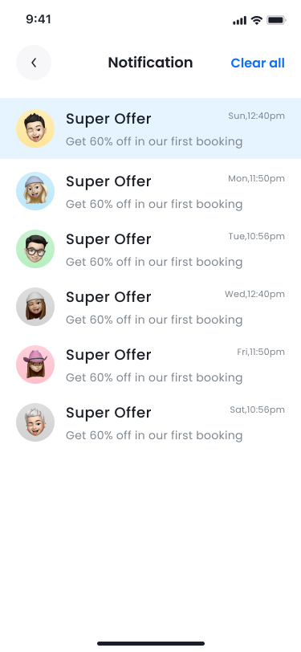
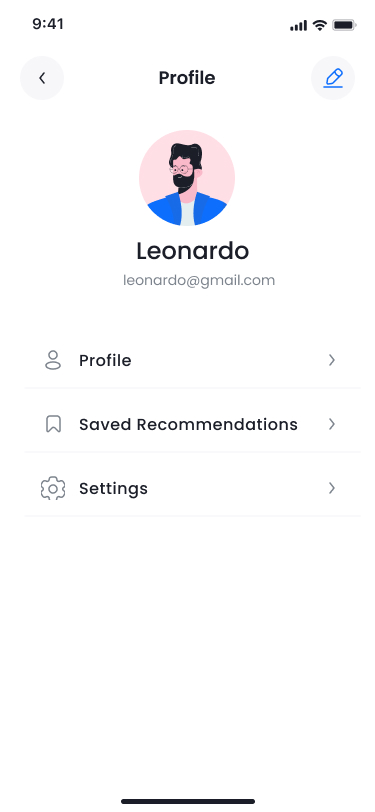
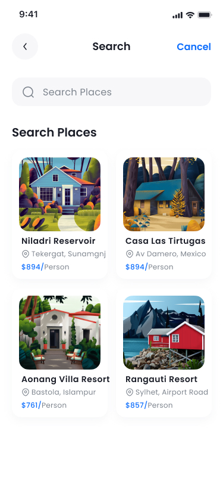
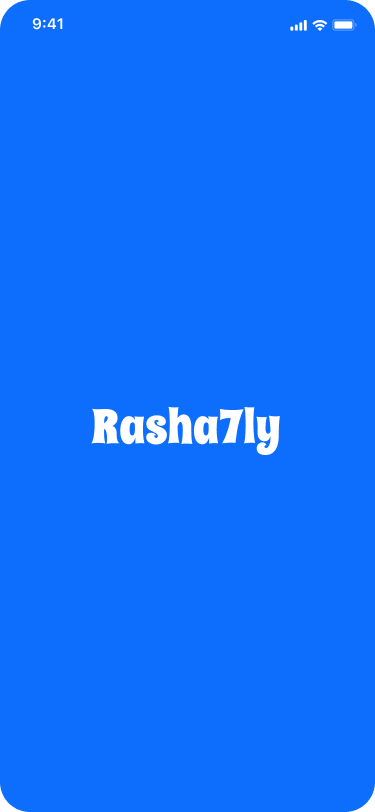
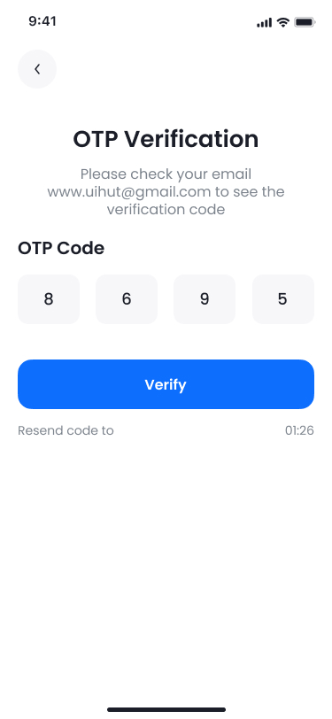

# Rasha7ly (رشحلي)

## 📌 Screenshots

---

## 📌 About the Project
Rasha7ly is a **recommendation app** that helps users when they are confused or undecided.  
If someone wants to go out with friends and doesn’t know where to go, they can simply open the app, choose their area, and browse recommendations shared by other users.

Users can:
- 🔍 Search by area.  
- ⭐ See ratings and reviews for each place.  
- 💬 Read comments (pros & cons) from people who visited.  
- 🏷️ Explore different categories of recommendations.  
- 🤖 Interact with a **chatbot** for quick suggestions.  
- 🏆 Earn **points** when their recommendations get high ratings.  

---

## 🎯 Categories
- 🍽️ **Outings** → Cafes, restaurants, and hangout spots.  
- 🏨 **Hotels** → For booking stays.  
- 💻 **Electronics** → Buying devices & gadgets.  
- ➕ More categories can be added based on user needs.  

---

## 🌟 Future Features
- **Chatbot Assistant**: helps users quickly find the right category and discover recommendations.  
- **Ratings & Comments**: users can share pros and cons about each place/product.  
- **Points System (Gamification)**:  
  - Users earn points when their recommendations are highly rated.  
  - Points can be used for badges, leaderboard rankings, or future rewards.  

---

## 🚀 Key Features
We are planning to add more features, such as:
- 📍 **Map Integration** → show nearby recommendations directly on a map.  
- 📲 **Social Sharing** → share recommendations with friends.  
- 🔔 **Notifications** → alert users when new recommendations are added in their area of interest.  
- 👥 **User Profiles** → track contributions, earned points, and badges.  
- 📊 **Analytics Dashboard** → insights on trending recommendations and categories.  

---

## 🌍 Vision
The goal of **Rasha7ly** is to create a trusted space for users to share and discover recommendations for anything they are uncertain about, from daily hangouts to major purchases.  

We aim to build a community-driven platform where recommendations are rewarded and easy to access.  

---

## 👥 Team Members
- Menna Ramadan
- Giovanni Arwen  
- Mustafa Hussien  
- Ibrahim Mohamed  
- Abdulrahman Ramadan  

---

## ⚠️ Note
The core part of the project has been completed, but many features are still under development.  
We plan to continue adding new functionalities and expanding the app after graduation.  
Features and categories are **subject to change** as we refine the final scope of the application.

